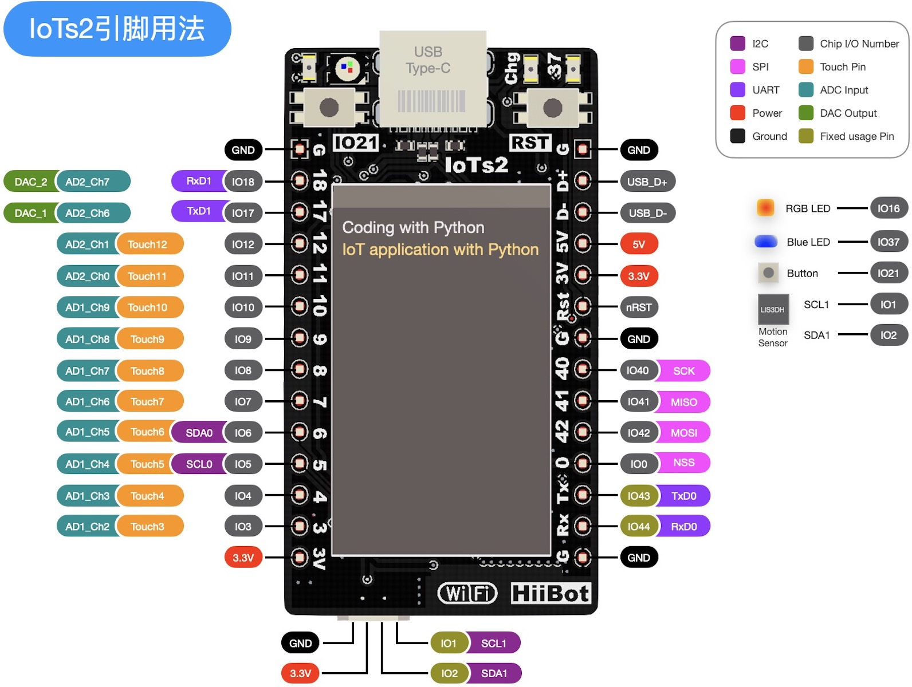

.. Python for Python4IoTs2 documentation master file, created by
   sphinx-quickstart on Fri Nov 22 16:08:05 2019.
   You can adapt this file completely to your liking, but it should at least
   contain the root `toctree` directive.

IoTs2帮助文档(Python版)
===============================================

IoTs2采用ESP32-S2(Xtensa 32-bit LX7单核CPU，主频达240MHz) WiFi SoC，
板上带有8MB FlashROM和8MB RAM、1.13寸彩色LCD(135x240点阵)、3轴加速度传感器(LIS3DH)，
以及1颗可编程RGB和1颗可编程蓝色LED、1个可编程按钮等资源。
板载大功率开关型DC-DC(输出3.3V@1.2A)可为功能拓展板供电，支持单节锂电池供电输入。
IoTs2采用双列(2x14)拓展接口和4P的mini-I2C(QWiic/STEMMA QT)拓展接口，
即可将IoTs2嵌入系统拓展板内使用，也可以使用I2C总线拓展系统功能。
IoTs2支持Scratch图形化编程语言和Python脚本编程语言，采用“拖放文件即下载程序”的操作模式，
不依赖任何特定的软件环境。

------------------------------------------------

合作咨询请联系：400-666-8152

-------------------------------------

IoTs2简介
-------------------------------------

.. toctree::
   :maxdepth: 2
   
   iots2_intro/index.rst

-------------------------------------

.. toctree::
   :caption: 使用IoTs2前的准备
   :maxdepth: 2
   
   iots2_setup/index.rst

-------------------------------------

.. toctree::
    :caption: IoTs2教程
    :numbered: 2

    iots2_tutorials/basics/index.rst
    iots2_tutorials/advance/index.rst
    iots2_tutorials/project/index.rst

-------------------------------------

.. toctree::
    :caption: IoTs2功能拓展
    :numbered: 2

    iots2_extend/basedio/index.rst
    iots2_extend/advanceio/index.rst
    iots2_extend/project/index.rst

-------------------------------------

.. toctree::
    :caption: IoTs2网络互联
    :numbered: 1

    iots2_network/uartio.rst
    iots2_network/canio.rst
    iots2_network/wifi.rst
    iots2_network/mqtt.rst
    iots2_network/hiibotiot_iots2.rst

-------------------------------------

.. toctree::
   :caption: IoTs2固件和开源库(Python版)
   :maxdepth: 1
   
   iots2_lib/iots2_firm.rst
   iots2_lib/iots2_lib.rst
   iots2_lib/iots2_api.rst

-------------------------------------

.. toctree::
   :caption: IoTs2固件和开源库(Python版)
   :maxdepth: 1
   
   iots2_hardware/schematic.rst
   iots2_hardware/pcb.rst

-------------------------------------

