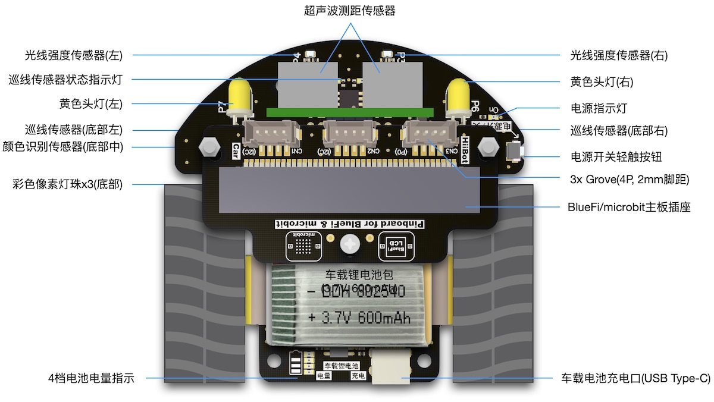
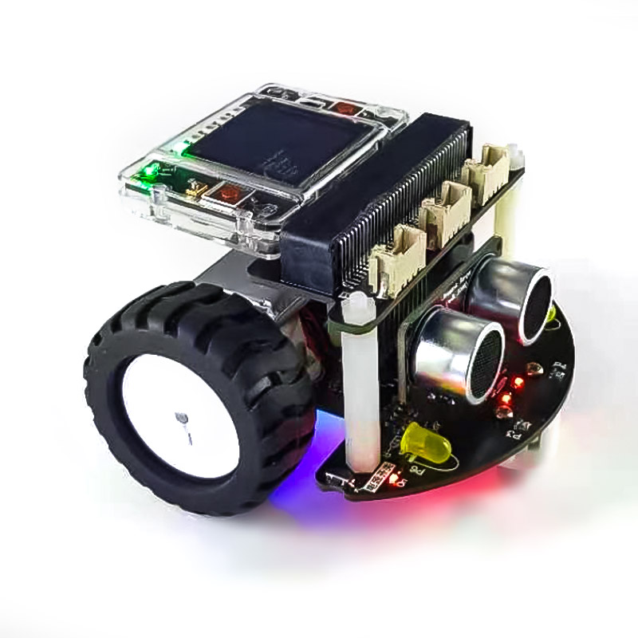
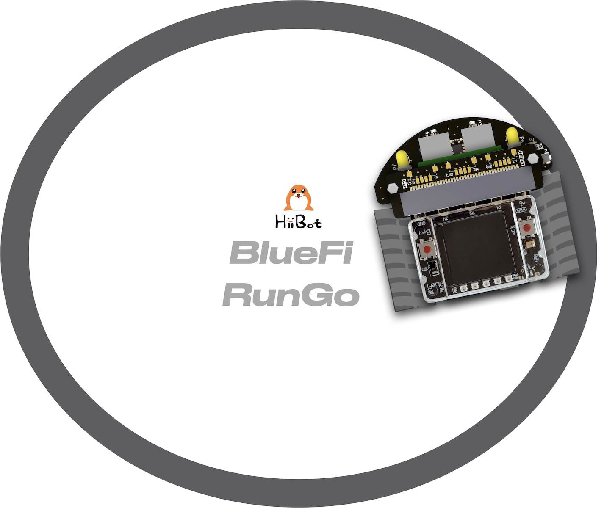
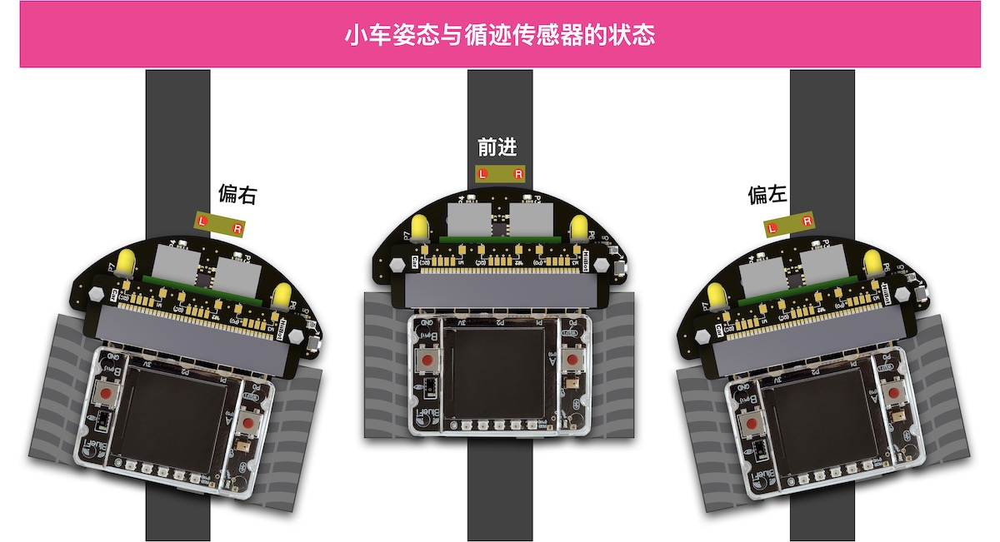
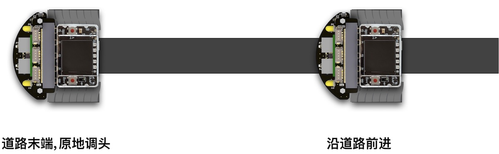
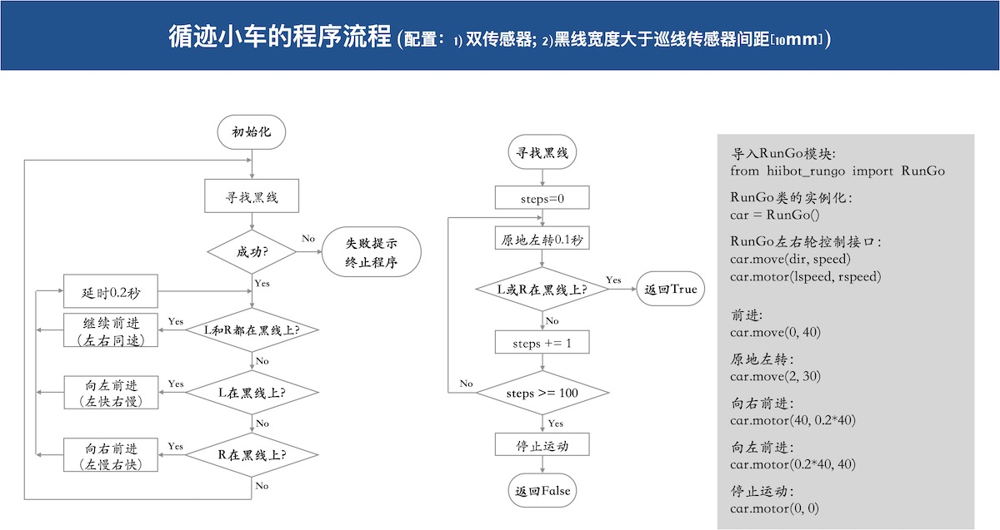
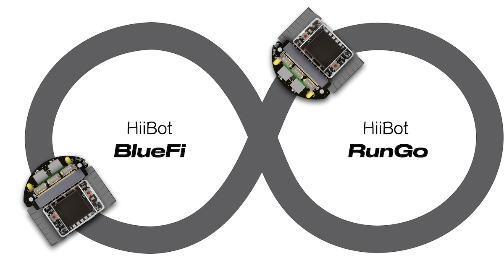
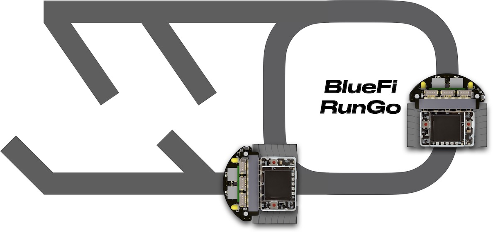

智能小车——RunGo
======================

跑酷小车(RunGo)由HiiBot推出的智能小车底盘，包含以下资源：

  - 3x 轻触按钮(1个是IoTs2模块自带的按钮使用IO21引脚)，A按钮使用IoTs2的IO43引脚，B按钮使用IoTs2的IO44引脚
  - 3x 底盘像素彩灯(位于小车底盘的底部/面向地面, pixels)，使用IoTs2的IO0引脚
  - 1x 颜色识别传感器(位于小车底盘的底部，识别地面上色块的颜色, groundColor)，使用IoTs2的IO7(A4)引脚
  - 2x 光线强度传感器(位于小车前部)，使用IoTs2的IO8(小车左前部光强度, leftLightSensor)和IO9(小车右前部光强度, rightLightSensor)引脚
  - 2x 黄色头灯(位于小车前部)，使用IoTs2的IO17(小车右前灯, rightHeadLED)和IO18(小车左前灯, leftHeadLED)引脚
  - 1x 超声波避障传感器(与前方障碍物之间的距离, distance)，使用IoTs2的IO10(Echo)和IO11(Trig)引脚
  - 2x 光电反射型循迹传感器，使用IoTs2的IO3(leftTracker)和IO4(rightTracker)引脚
  - 2x 直流有刷电机(N20型)，使用IoTs2的IO12(IN1)和IO40(IN2)(左马达)、IO41(IN1)和IO42(IN2)(右马达)引脚
  - 1x 车载锂电池包(3.7V,600mAh)及其充电和电量指示单元，使用USB Type C接口实现快速充电(20~30分钟即可充满)，满电后可连续使用1小时以上
  - 1x 高效的车载电源管理单元，小车底盘右前方的轻触按钮可开启/关闭小车电源，

---------------------------------

RunGo小车底盘的传感器和分布(示意图)，如下图所示：

IoTs2+RunGo组成智能小车(实物图)，如下图所示。

----------------------------------

使用前准备工作：添加RunGo库模块
----------------------------------

使用RunGo小车前，请点击“下载按钮”下载RunGo的Python库文件 
:download:`hiibot_iots2_rungo.py <../../_static/files_dl/hiibot_iots2_rungo.py>`  到本地，
然后将该文件保存到IoTs2的"/CIRCUITPY/lib/"文件夹中。

注意，请使用USB数据线将IotS2与你的电脑连接在一起，电脑的资源管理器中出现“CIRCUITPY”磁盘，然后将RunGo的Python库文件复制到"/CIRCUITPY/lib/"文件夹即可。
注意，部分IoTs2的lib文件夹中已有hiibot_iots2_rungo.py库文件的，请忽略此步骤。检查方法：使用USB数据线将IoTs2与电脑连接，出现CIRCUITPY磁盘后，
展开"/CIRCUITPY/lib/"文件夹，检查是否已有“hiibot_iots2_rungo.py”或“hiibot_iots2_rungo.mpy”，其中“py”格式是Python脚本源码库，“mpy”格式是压缩的Python脚本源码库，
前者是文本格式具有可读性但文件较大，后者是二进制格式无可读性但文件较小。

.. Important::
  **RunGo+IoTs2模块的USB接口和操作顺序**

  - RunGo底盘的USB Type-C的充电接口仅仅用于对车载锂电池充电，不能用于其他功能。**充电用的USB插座位于RunGo底盘的尾部**
  - IoTs2模块使用USB Type-C供电和通讯，下载程序或更新固件必须使用这个USB端口。**下载程序和通讯用的USB插座位于IoTs2模块上，在小车顶部**
  - 正常开机顺序：1) 按下RunGo右前方的电源开关即可开机，再次按下则关机；2) 任何时候必须首先开启RunGo的电源才能进行其他操作
  - 下载程序的顺序：1) 打开RunGo电源(见前一步)；2) 等待IoTs2启动完毕(LCD屏幕上将会出现提示文字)；3) 使用USB数据线将IoTs2模块与电脑连接(不必取下模块)；4) 电脑的资源管理器中将出现一个名叫“CIRCUITPY”的可移动磁盘，然后可以通过复制-粘贴等操作下载程序
  - 关机顺序：1) 首先将连接电脑和IoTs2模块的USB数据线拔掉；2) 按下RunGo电源开关即可。注意，当我们使用USB数据线将IoTs2模块与电脑连接时，按下RunGo电源开关将不能关闭电源

--------------------------------

让RunGo动起来
--------------------------------

当你拿到RunGo和IoTs2之后，并做好前述的准备工作做，我们首先让RunGo小车动起来。
实现的效果：小车前进一段距离；然后开启右转灯并开始右转，然后关闭右转灯并停止右转；如此循环。

示例程序代码如下：

.. code-block::  python
  :linenos:

  import time
  from hiibot_iots2 import IoTs2
  from hiibot_iots2_rungo import RunGo
  iots2 = IoTs2()
  iots2.screen.rotation = 180
  print('Run Go!')
  car = RunGo()
  carspeed = 100
  go = False
  cnt = 0
  fsm = 0
  print('Button-A -> run')
  print('Button-B -> stop')
  while True:
      car.pixelsRotation()
      car.buttons_update()
      if car.button_A_wasPressed:
          go = True
          print('running')
      if car.button_B_wasPressed:
          go = False
          cnt = 0
          fsm = 0
          car.rightHeadLED = 0   # turn off right head lamp
          car.stop()
          print('stoping')
      time.sleep(0.01) # 10ms
      if go:
          if fsm==0:
              car.motor(carspeed, carspeed)
              cnt += 1
              if cnt>50:
                  cnt = 0
                  car.stop()
                  fsm = 1
          elif fsm==1:
              car.rightHeadLED = 1   # turn on right head lamp
              car.motor(carspeed//2, -carspeed//2)
              cnt += 1
              if cnt>65:
                  car.rightHeadLED = 0   # turn off right head lamp
                  car.stop()
                  cnt = 0
                  fsm = 0
      else:
          pass

请首先打开RunGo电源，当IoTs2屏幕上有显示内容出现后，使用USB数据线将IoTs2模块与电脑连接，然后我们电脑资源管理器中将出现一个名叫“CIRCUITPY”磁盘，
将上述示例代码保存到IoTs2的/CIRCUITPY/code.py文件，请观察RunGo小车的动作是否达到我们的预期效果。

请注意：下载程序时务必使用IoTs2模块的USB插座，该插座位于RunGo+IoTs2的顶部！

上述示例程序虽然看起来很长，但非常容易理解。前三行语句是导入Python模块；第4行程序是将IoTs2类实例化为“iots2”，
第5行则使用实体对象“iots2”设置其属性将IoTs2模块的LCD屏幕旋转为180度，即竖屏显示；
第7行程序语句是将RunGo类实例化为“car”，后面的程序中将使用实体对象“car”的属性或接口来控制RunGo小车运动。

在无穷循环程序块中，我们使用“car.pixelsRotation()”函数控制RunGo底部的3颗彩灯形成旋转光效；并调用“car.buttons_update()”接口更新RunGo的A和B按钮的状态；
当A按钮按下时则启动RunGo进入运动状态，按下B按钮则停止RunGo运动；当RunGo处于运动状态时，我们调用“car.motor(左轮速度和方向, 右轮速度和方向)”接口控制小车前进、
后退、左转和右转，该接口的两个参数分别代表左轮速度和方向、右轮速度和方向，负数表示反转，正数表示正转，数值绝对值的大小代表速度，速度取值0～255。

此外，本示例也展示如何控制RunGo小车的左/右头灯。

--------------------------------

识别地面颜色(色块)
--------------------------------

RunGo小车的底部有一个颜色识别传感器，可用于识别地面的颜色或色块，有效识别区域是巡线传感器的区域(颜色识别传感器在标注“P2”文字的地方)。
本示例程序实现的效果：让小车置于白、红、黄、绿、青、蓝或紫色的地面或贴有这些颜色色块之上，按下A按钮后，IoTs2的RGB彩灯将显示对应的地面颜色，
并在LCD屏幕上显示颜色的名称字符串(White、Red、Yellow、Green、Cyan、Blue或Purple)。

示例程序代码如下：

.. code-block::  python
  :linenos:

  from hiibot_iots2 import IoTs2
  from hiibot_iots2_rungo import RunGo
  iots2 = IoTs2()
  car = RunGo()
  iots2.pixels.brightness = 0.3
  iots2.pixels[0] = (0,0,0)
  car.stop() # stop motors
  print("Press Button-A to sense ground color")
  car.pixels.fill(0)
  car.pixels.show()
  while True:
      car.buttons_update()
      if car.button_A_wasPressed:
          cid = car.groundColorID # get ground color id (0~6)
          print(car.groundColor_name[cid])
          iots2.pixels[0] = car.groundColor_list[cid]

请将上述示例代码保存到IoTs2的/CIRCUITPY/code.py文件，每次按下RunGo的A按钮即可执行一次“地面颜色”识别，
并将识别出来的颜色名字字符串显示到LCD屏幕上，同时IoTs2模块上的RGB彩灯(USB插座旁边)也显示出同样的颜色。

上述示例程序的无穷循环程序块中，我们使用“car.buttons_update()”接口检测A按钮是否被按下，如果被按下则开始识别地面颜色并返回颜色识别结果(颜色ID)，
使用“car.groundColor_name[color_id]”列表返回该颜色ID对应的颜色名称(字符串)并打印到屏幕上，
然后使用“car.groundColor_list[id]”列表返回该颜色ID对应的颜色的RGB分量值(元组类型)，并让IoTs2的RGB彩灯显示这种颜色。

-------------------------------

电子围栏
-------------------------------

前面的示例程序中逻辑问题都是非常简单的，下面我们来实现一个稍微复杂一点的程序逻辑和动作效果：地上画个黑色圆作为电子围栏的边界，
RunGo小车就在围栏内随意行驶。准备工作：在白色地面或纸上贴上宽度大于1公分以上的黑色胶带或不干胶，确保黑色胶带围成一个封闭的图案，
并将RunGo小车放在图案内。图案可以参考下图所示：

执行下面的示例代码，你会看到RunGo小车在电子围栏内随意地行驶，但始终不会跑出围栏。

.. code-block::  python
  :linenos:

  import time
  # import RunGo module from hiibot_iots2_rungo.py
  from hiibot_iots2_rungo import RunGo
  car = RunGo()
  print("Run Go!")
  # speed=100, 0, forward; 1, backward; 2, rotate-left; 3, rotate-right
  car.stop() # stop motors
  print("press Button-A")
  car.rightHeadLED = 0
  car.leftHeadLED = 0
  carSpeed_fast = 100
  carSpeed_slow = 70
  carrun = False
  idleCnt = 0
  while True:
      idleCnt+=1
      if idleCnt>=50000:
          for i in range(3):
              car.pixels[i] = (0,0,0)
          car.pixels.show()
      else:
          car.pixelsRotation()
      car.buttons_update()
      if car.button_A_wasPressed:
          carrun = True
          idleCnt = 0
          print("running")
      if car.button_B_wasPressed:
          car.stop()
          idleCnt = 0
          print("stop")
          carrun = False
      lt = car.leftTracker   # left sensor
      rt = car.rightTracker  # right sensor
      if carrun:
          idleCnt = 0
          if lt ==1 and rt ==1 :  # dual sensor above back-line
              car.stop()
              car.move(1, 0-carSpeed_fast)  # backward
              time.sleep(0.2)
              car.stop()
              car.move(2, carSpeed_fast)  # turn left
              time.sleep(0.2)
              car.stop()
          elif lt ==1 :  # left sensor above back-line only
              car.stop()
              car.rightHeadLED = 1
              car.move(3, carSpeed_fast)  # turn right
              time.sleep(0.2)
              car.stop()
              car.rightHeadLED = 0
          elif rt ==1 :   # right sensor above back-line only
              car.stop()
              car.leftHeadLED = 1
              car.move(2, carSpeed_fast)  # turn left
              time.sleep(0.2)
              car.stop()
              car.leftHeadLED = 0
          else: 
              car.move(0, carSpeed_slow)  # forward
              time.sleep(0.02)
      pass

将示例程序保存到IoTs2的/CIRCUITPY/code.py文件中，等待我们的程序正式开始运行后，按下RunGo的A按钮，
并将整个小车放在黑色胶带围成的封闭图案内，你将看到RunGo小车始终在围栏内行驶。
当你想要让RunGo小车停下时，请按下RunGo的B按钮即可，或者直接关闭RunGo电源。

为什么RunGo小车不会越过黑色胶带围成的“围栏边界”呢？我们使用RunGo小车底部的一对循迹传感器来侦测小车是否到达“围栏边界”，
如果遇到边界则根据这对传感器的状态来调整行驶方向：如果两个传感器都侦测到黑色边界，则先后退一段距离再左转；
如果只有左侧传感器侦测到黑色边界则右转；如果右侧传感器侦测到黑色边界则左转；如果传感器都未侦测到黑色边界则继续前进。

这是本示例程序的无穷循环程序块中的关键逻辑，或者说这就是实现“电子围栏”效果的关键逻辑。
本示例中增加2个按钮做交互实现开始行驶和停止行驶的功能，也属于无穷循环程序块的一部分逻辑。

为了达到更好的视觉效果，我们可以使用RunGo小车底盘的3颗彩灯来指示行驶、停车状态：在围栏内行驶期间3颗彩灯的颜色不断地转动；
当停车时彩灯颜色全部保持白色。

你可以根据本向导底部的接口库介绍来掌握RunGo小车的控制接口，然后设计更加有趣的示例。

-------------------------------

循迹小车
-------------------------------

AGV(Automatic Guided Vehicle，无人搬运车)小车已经是很多现代车间里最重要的物料“搬运工”！沿着预先规划好的
路线能够无人且自动驾驶的货车能够将仓库的物料自动地运送到指定工位，并从指定工位将产品自动运送会成品仓库。这些曾
经依靠人力或依靠司机开着货车来完成的工作，现在逐步被AGV代替。

AGV如何实现“沿着规定路线行驶到指定停靠点”呢？有很多种方法可以实现AGV的功能，本向导给出一种循迹的方法。使用循迹
传感器反馈的状态信号控制RunGo小车运动来模拟AGV。

我们采用地面贴黑色胶带或黑色不干胶来“指定路线”，编程控制RunGo小车沿着该路线行驶(允许弯曲的路线)，到达路线末端后自动
调头并原路返回。为了更好地理解循迹的程序逻辑，我们先分析下图的三种情况：

根据上图所示，容易回答以下问题：如果小车向右偏离路线我们应该如何纠偏呢？向左偏离时又如何纠偏呢？
此外，当我们达到道路末端时循迹传感器的状态是怎样？如何让RunGo小车绕自身中心调头呢？

简单地分析这几种特殊情况将有助于掌握下面的示例程序中的关键逻辑和代码。本示例的准备工作非常简单，
使用前示例所用的黑色胶带围成的封闭边界作为本次循迹的“指定路线”。

循迹小车的示例程序如下：

.. code-block::  python
  :linenos:

  import time
  import random
  from hiibot_iots2 import IoTs2
  from hiibot_iots2_rungo import RunGo
  iots2 = IoTs2()
  iots2.screen.rotation = 180
  car = RunGo()
  car.stop()  # stop car one second
  carspeed = 80
  time.sleep(1)
  running = False
  def  searchBackLine():
      global car
      for steps in range(360):
          rdir = random.randint(0, 2)
          if rdir==0:
              car.move(2, 60)
          else:
              car.move(3, 60)
          time.sleep(0.005)
          if not car.rightTracker or not car.leftTracker:
              # backlin be searched by any sensor
              car.stop()
              return True
      car.stop()
      return False
  while True:
      car.pixelsRotation()
      car.buttons_update()
      if car.button_A_wasPressed:
          running = True
          print("running")
      if car.button_B_wasPressed:
          car.stop()
          print("stop")
          running = False
      lt = car.leftTracker   # left sensor
      rt = car.rightTracker  # right sensor
      if running:
          # two sensors is above backline, go on
          if lt and rt:
              car.motor(carspeed, carspeed)
          # left sensor is above backline, but right sensor missed backline, thus turn left
          elif lt:
              car.motor(carspeed//2, carspeed)
          # right sensor is above backline, but left sensor missed backline, thus turn right
          elif rt:
              car.motor(carspeed, carspeed//2)
          # two sensors missed backline, thus stop car and search backline
          else:
              car.stop()
              print("black line is missing, need to search the black line")
              if not searchBackLine():
                  break
          time.sleep(0.01)
      else:
          pass

看起来程序代码很长！为了帮助你理解程序语句的作用，请分析下面的流程图，并对照程序代码、执行程序时RunGo小车的行为。

将上面的示例程序保存到IoTs2的/CIRCUITPY/code.py文件中，然后将RunGo小车放在黑色胶带上方，
等待我们的程序正式开始运行后，观察程序的执行效果。如果你想要让RunGo小车停下来，按下B按钮即可。
如果想要RunGo小车继续巡线行驶，按下A按钮即可。

虽然本示例程序看起来很长，真正的循迹控制逻辑只是在无穷的循环体中。

此外，本示例程序中包含一个容错处理，被定义成子程序searchBackLine。该子程序可以实现：
当RunGo小车的两个循迹传感器都未检测到“指定路线”的黑色道路时，小车将自动开始绕自身中心旋转，找到黑色道路后再继续沿路行驶。
如果你未将小车放在黑色道路上方，该容错程序将控制RunGo小车原地打转几圈来尝试找黑色道路，如果尝试几圈都未找到黑线则自动停车。

你也可以试一试如下图所示的“指定路线”，你能预测自己的RunGo小车会如何行驶？

事实上，企业车间的仓库分为原料仓库、半成品仓库、成品仓库等多种，生产工位较多，如何实现多点物料搬运？需要我们去探索，
下图是多点物料搬运问题的抽象图例，你可以使用黑色胶带或不干胶绘制这些图中的“指定路线”，编程实现沿着这些“指定路线”自动搬运物料的小车。

或许你觉得单纯使用巡线传感器的信息并不足以实现自己的想法，RunGo小车底盘带有颜色识别传感器，可以用来识别地面的颜色，
如果我们在道路的分叉口的地面贴上一些特殊颜色，譬如红、黄、绿、青、蓝和紫色等，每种颜色代表不同的旋转方向，
或许实现上图的多点之间货物运输会变得非常简单。动手试一试吧。

-------------------------------

AGV避障
--------------------------------

如果AGV行驶过程中遇到障碍物怎么办？譬如有人正好站在AGV行驶路线上，此时AGV绝对不能直接撞上去。问题是，AGV
如何知道前方有人？RunGo小车带有一个超声波传感器，能够检测2公分到4米距离内的障碍物。下面我们修改前一个示例实现
这一功能：当RunGo小车的行驶方向有障碍物时，让RunGo小车自动停下来，直到障碍物被移除。

--------------------------------

让RunGo配合你扮演“气功大师”
--------------------------------

武林高手能隔山打牛、隔空取物，气功大师能用气击倒对手。本示例的执行效果：让RunGo当个“托儿”帮助我们表演气功大师的绝招。
气功大师不仅能用手掌“发气”隔空推动RanGo小车后退，还能用手掌隔空“吸引”RunGo小车，其中的奥秘是什么呢？

请注意，本示例程序需要使用超声波传感器，请将超声波传感器模块正确地插在RunGo小车上。

本示例程序的代码如下：

.. code-block::  python
  :linenos:

  import time
  from hiibot_iots2 import IoTs2
  from hiibot_iots2_rungo import RunGo
  iots2 = IoTs2()
  car = RunGo()
  car.stop()
  iots2.screen.rotation = 180
  print('Run Go!')
  minDistance = 8.0
  maxDistance = 15.0
  carMaxSpeed = 80
  speedsList = [carMaxSpeed, carMaxSpeed-10, carMaxSpeed-20, carMaxSpeed-30]
  running = False
  idleCnt = 0
  while True:
      idleCnt += 1
      if idleCnt>50000:
          for i in range(3):
              car.pixels[i] = (0,0,0)
          car.pixels.show()
      else:
          car.pixelsRotation()
      car.buttons_update()
      if car.button_A_wasPressed:
          running = True
          idleCnt = 0
          print('running')
      if car.button_B_wasPressed:
          running = False
          car.stop()
          idleCnt = 0
          print('stopping')
      if running:
          idleCnt = 0
          ds = car.distance
          if ds<minDistance:
              si = int(minDistance-ds)
              if si<len(speedsList):
                  s = speedsList[si]
              else:
                  s = speedsList[3]
              car.motor(-s, -s)
          elif ds>maxDistance:
              si = int(ds-maxDistance)
              if si<len(speedsList):
                  s = speedsList[3-si]
              else:
                  s = speedsList[0]
              car.motor(s, s)
          else:
              car.stop()
          time.sleep(0.01)
      else:
          pass

将示例程序保存到IoTs2的/CIRCUITPY/code.py文件中，等待我们的程序正式开始运行后，
按下RunGo的A按钮，然后用手掌靠近或远离RunGo小车的超声波，观察程序的执行效果是否有“武林高手”、“气功大师”隔空推车、隔空取物等效果。

--------------------------------

帮助RunGo走出“巨石阵”
--------------------------------

三国演义中诸葛亮在长江边摆的“巨石阵”让诸多敌人有进无出。你能使用今天的科技手段帮助RunGo走出纸杯模拟的“诸葛巨石阵”吗？

示例程序代码如下：

.. code-block::  python
  :linenos:

  import time
  import random
  from hiibot_iots2 import IoTs2
  from hiibot_iots2_rungo import RunGo
  car = RunGo()
  iots2 = IoTs2()
  car.stop()
  iots2.screen.rotation = 180
  print('Run Go!')
  minDistance = 8.0
  maxDistance = 15.0
  badDistance = 440.00
  carMaxSpeed = 80
  carMinSpeed = 60
  pdt = [0, 0, 0]
  running = False
  idleCnt = 0
  # 检查是否堵住(堵住时连续的距离变化非常小)
  def stallCheck(dt) :
      dif0 = abs(pdt[0] - pdt[1])
      dif1 = abs(pdt[1] - pdt[2])
      dif2 = abs(pdt[2] - dt)
      pdt[0] = pdt[1]
      pdt[1] = pdt[2]
      pdt[2] = dt
      if 0.4>max(dif0, dif1, dif2):
          return True
      else:
          return False
  # 随机转弯
  def randomTurn():
      global car, carMinSpeed, carMaxSpeed
      car.stop()
      time.sleep(0.01)
      dir = random.randint(0,2)
      if dir==1:
          car.motor(carMinSpeed, -carMinSpeed)
      else:
          car.motor(-carMinSpeed, carMinSpeed)
      time.sleep(0.5)
      car.motor(carMaxSpeed, carMaxSpeed)
  # 先后退一段距离再随机转弯    
  def backThenRandomRurn():
      global car, carMaxSpeed
      car.stop()
      time.sleep(0.01)
      car.motor(-carMaxSpeed, -carMaxSpeed)
      time.sleep(0.4)
      randomTurn()
  # 主循环：检查是否待机，待机则关闭彩灯；检查启动(A)或停止(B)；
  # 启动后检测障碍物距离并决定前进/随机转弯/先后退再随机转弯等3种行为
  while True:
      idleCnt += 1
      if idleCnt>50000:
          for i in range(3):
              car.pixels[i] = (0,0,0)
          car.pixels.show()
      else:
          car.pixelsRotation()
      car.buttons_update()
      if car.button_A_wasPressed:
          running = True
          idleCnt = 0
          print('running')
      if car.button_B_wasPressed:
          running = False
          car.stop()
          idleCnt = 0
          print('stopping')
      if running:
          time.sleep(0.01)
          idleCnt = 0
          dt = car.distance
          if stallCheck(dt):
              backThenRandomRurn()
              continue
          if dt<minDistance or dt>badDistance:
              backThenRandomRurn()   
          elif dt<maxDistance:
              randomTurn()
          else:
              car.motor(carMaxSpeed, carMaxSpeed)
      else:
          pass

确保IoTs2模块正确地插在RunGo小车上，并开启RunGo电源(RunGo的电源开关旁边有一颗红色LED的亮/灭指示电源状态)，
使用USB数据线将IoTs2模块与电脑连接好，当电脑资源管理器中出现CIRCUITPY磁盘后，将上述的示例代码保存到IoTs2的/CIRCUITPY/code.py文件，
当程序执行时按下RunGo的A按钮，并将RunGo小车放在“巨石阵”中，观察RunGo如何走出我们的“巨石阵”。

考虑到纸杯或其他物品组成的“巨石阵”中障碍物之间的距离，建议根据测试结果修改上述示例程序的第10行和第11行程序代码等号右边的数值，
这两行语句常数值大小决定RunGo距离障碍物多远就开始随机转弯(为什么是“随机”?) 多远则先后退再随机转弯。
如果你设计的“巨石阵”中障碍物之间距离较小则将两行程序等号右边的数值也随之修改为更小的值，反之亦然。

本示例程序的关键逻辑包括：判断RunGo是否被堵、判断前方障碍物距离是否小于允许的最小距离或不大于最大距离等几种情况的识别，
我们根据每一种情况来确定RunGo的下一步行为：继续前进、随机转弯、先后退再随机转弯等。

此外，我们使用RunGo的按钮A和B控制RunGo是否开始“闯阵”或停止，在程序运行期间保持RunGo底部的3个RG彩灯不断地旋转，
如果停止时间超过25秒则关闭这些彩灯以节能。

--------------------------------

RunGo的“趋光性”
--------------------------------

RunGo的前部带有一对光线强度传感器能够识别前方光线的方向(哪个方向的光线更亮)

.. code-block::  python
  :linenos:

  import time
  from hiibot_iots2 import IoTs2
  from hiibot_iots2_rungo import RunGo
  iots2 = IoTs2()
  car = RunGo()
  car.stop()
  iots2.screen.rotation = 180
  print('Run Go!')
  minDistance = 8.0
  maxDistance = 15.0
  carMaxSpeed = 100
  speedsList = [carMaxSpeed-30, carMaxSpeed-20, carMaxSpeed-10, carMaxSpeed]
  running = False
  idleCnt = 0
  diff = 200
  preDiff = 0
  df_scale = 300
  def checkDirection():
      global car, diff, preDiff, df_scale
      ls, rs = car.leftLightSensor, car.rightLightSensor
      preDiff = diff
      diff = abs(ls-rs)
      ediff = abs(diff-preDiff)
      if diff<df_scale:
          if diff>preDiff and ediff>100:
              return 3
          else:
              return 0
      elif ls>rs:
          return 1
      else:
          return 2
  while True:
      idleCnt += 1
      if idleCnt>50000:
          for i in range(3):
              car.pixels[i] = (0,0,0)
          car.pixels.show()
      else:
          car.pixelsRotation()
      car.buttons_update()
      if car.button_A_wasPressed:
          running = True
          idleCnt = 0
          print('running')
      if car.button_B_wasPressed:
          running = False
          car.stop()
          idleCnt = 0
          print('stopping')
      if running:
          idleCnt = 0
          dir = checkDirection()
          if dir==0:
              car.stop()
          elif dir==1:
              scale = int(diff/df_scale)
              if scale<len(speedsList):
                  s = speedsList[scale]
              else:
                  s = speedsList[3]
              car.motor(int(s*0.4), s)
          elif dir==2:
              scale = int(diff/df_scale)
              if scale<len(speedsList):
                  s = speedsList[scale]
              else:
                  s = speedsList[3]
              car.motor(s, int(s*0.4))
          else:
              car.motor(carMaxSpeed, carMaxSpeed)
          time.sleep(0.01)
      else:
          pass

---------------------------------

.. admonition:: 
  总结：

    - 按钮输入
    - 实体对象的属性的状态
    - 变量
    - 变量赋值
    - 变量自增/自减
    - 逻辑组合
    - 逻辑判断和逻辑程序块
    - 循环和嵌套循环
    - 函数及其定义
    - RGB彩灯及其接口与光效控制
    - 小车方向、速度
    - 小车转弯(差速)
    - 颜色识别
    - 光电反射传感器
    - 巡线/循迹传感器
    - 超声波测距传感器
    - 本节中，你总计完成了84行代码的编写工作

.. Important::
  **RunGo类(hiibot_iots2_rungo.py模块)的属性和接口**

    - car (自定义的RunGo类实例化对象)：

      - from hiibot_iots2_rungo import RunGo  # 从hiibot_iots2_rungo.py模块导入RunGo类
      - car = RunGo() # 将RunGo类实例化，实体对象"car"可以自定义为其他名称

    - pixels (底盘像素彩灯子类，默认3颗RGB(兼容WS2812B)/50%亮度/GRB模式)支持的接口方法和属性包括：

      - car.pixels.fill( (R,G,B) ): 填充全部像素为设定颜色
      - car.pixels.show(): 刷新全部像素
      - car.pixels.brightness: 全部像素的亮度属性值(可读可写的)，属性值范围：0.0(灭)~1.0(最亮)
      - car.pixels[index]: 指定某个像素的颜色属性(可读可写的), index有效值范围：0~2；属性值为(R, G, B)

    - A和B两个按钮支持的接口方法和属性包括：

      - car.button_A (属性, 只读的, 有效值：0/False(释放时) 或 1/True(按下时)), RunGo的可编程按钮A的状态
      - car.button_B (属性, 只读的, 有效值：0/False(释放时) 或 1/True(按下时)), RunGo的可编程按钮B的状态
      - car.buttons_update() (函数，无输入参数，无输出参数)，必须在RunGo控制程序的无穷循环中调用该函数，目的是更新按钮的状态和去抖动操作
      - car.button_A_wasPressed (属性, 只读的, 有效值：0/False(未被按下) 或 1/True(已被按下)), 检测RunGo的可编程按钮A是否已被按下
      - car.button_A_wasReleased (属性, 只读的, 有效值：0/False(未被释放) 或 1/True(已被释放)), 检测RunGo的可编程按钮A是否已被释放
      - car.button_A_pressedFor(dt) (函数，输入参数：被长按的时间阈值；返回值：0/False(未被长按超过指定时间) or 1/True(已被按下且超过指定时长)), 检测RunGo的可编程按钮A释放被长按超过指定的时间
      - car.button_B_wasPressed (属性, 只读的, 有效值：0/False(未被按下) 或 1/True(已被按下)), 检测RunGo的可编程按钮B是否已被按下
      - car.button_B_wasReleased (属性, 只读的, 有效值：0/False(未被释放) 或 1/True(已被释放)), 检测RunGo的可编程按钮B是否已被释放
      - car.button_B_pressedFor(dt) (函数，输入参数：被长按的时间阈值；返回值：0/False(未被长按超过指定时间) or 1/True(已被按下且超过指定时长)), 检测RunGo的可编程按钮B释放被长按超过指定的时间

    - groundColor (地面颜色传感器)支持的接口方法和属性包括：

      - car.groundColorID: 地面颜色ID属性值(只读的)，地面颜色ID属性值有效范围：0~6
      - car.groundColorValue: 地面颜色的RGB值属性(只读的)，该属性值为“元组型”颜色分量值：(R, G, B)
      - car.groundColor: 地面颜色的名称属性(只读的)，地面颜色的名称有效值为：'white' (ID=0), 'Red', 'Yellow', 'Green', 'Cyan','Blue','Purple' (ID=6)

    - LightSensor (小车前部光线强度传感器)支持的接口方法和属性包括：

      - car.rightLightSensor: 右前部光线强度的属性值(只读的)，该属性值有效范围：0~65535
      - car.leftLightSensor: 右前部光线强度的属性值(只读的)，该属性值有效范围：0~65535

    - HeadLED (小车(黄色)前灯)支持的接口方法和属性包括：

      - car.rightHeadLED: 右(黄色)前灯的属性值(可读可写的)，该属性值有效范围：1或0, True或False；1或True: On, 0或False: Off
      - car.leftHeadLED: 左(黄色)前灯的属性值(可读可写的)，该属性值有效范围：1或0, True或False；1或True: On, 0或False: Off

    - distance (超声波测距传感器)获取的小车与障碍物之间的距离属性值(只读的)，有效值范围：2.0~400.0,量纲为cm(厘米)

    - Tracker (小车底盘的巡线传感器)支持的接口方法和属性包括：

      - car.rightTracker: 右前部巡线传感器的状态属性值(只读的)，该属性值有效范围：1或0, True或False；1或True: 黑线, 0或False: 非黑线
      - car.leftTracker: 左前部巡线传感器的状态属性值(只读的)，该属性值有效范围：1或0, True或False；1或True: 黑线, 0或False: 非黑线
      - car.tracking(mode): 巡线传感器对儿的状态属性值(只读的)，该属性值有效范围：1或0, True或False；1或True: 小车在线上, 0或False: 小车偏离线；mode有效值：0:使用较宽(线宽大于两个巡线传感器的间距[1cm])的黑色线，左右巡线传感器同时在黑线上；1:使用较窄(线宽小于两个巡线传感器的间距[1cm])的黑色线，仅左巡线传感器在黑线上；2:使用较窄(线宽小于两个巡线传感器的间距[1cm])的黑色线，仅右巡线传感器在黑线上；3:使用较宽(线宽大于两个巡线传感器的间距[1cm])的白色线，左右巡线传感器同时在白线上

