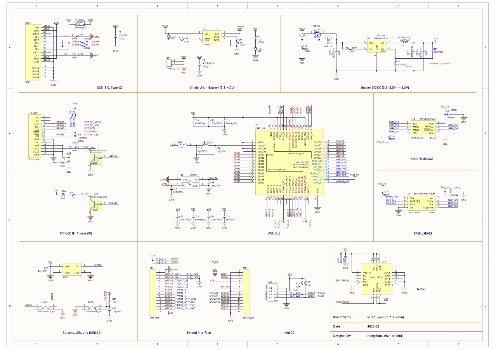
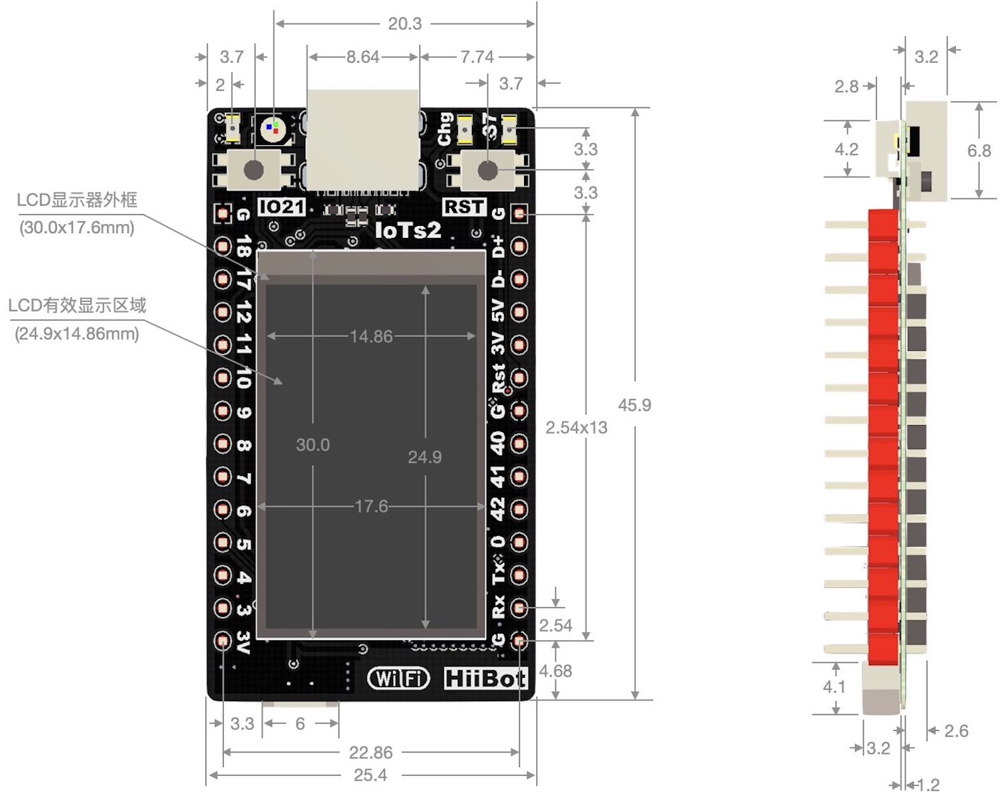
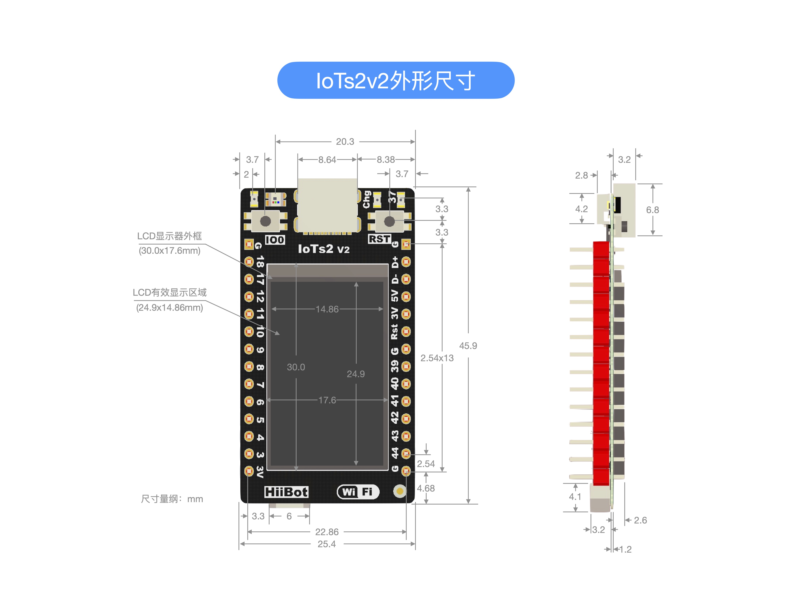

==========================
IoTs2内部组成和电路原理图
==========================

IoTs2的内部组成单元如下图所示：

.. image::  ../_static/images/iots2_structure.jpg
  :scale: 25%
  :align: center

(IoTs2_v1)

.. image::  ../_static/images/iots2v2_structure.jpg
  :scale: 15%
  :align: center

(IoTs2_v2)

IoTs2的电路原理如下图所示：

.. image::  ../_static/images/iots2_sch.jpg
  :scale: 40%
  :align: center

(IoTs2_v1)

(IoTs2_v2)

IoTs2的尺寸规格如下图所示：

(IoTs2_v1)

(IoTs2_v2)

上图的尺寸量纲为mm。
