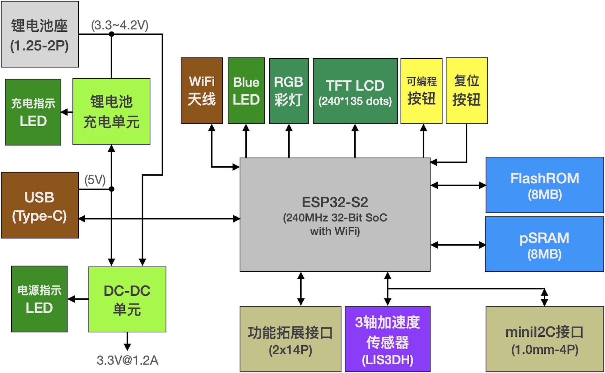
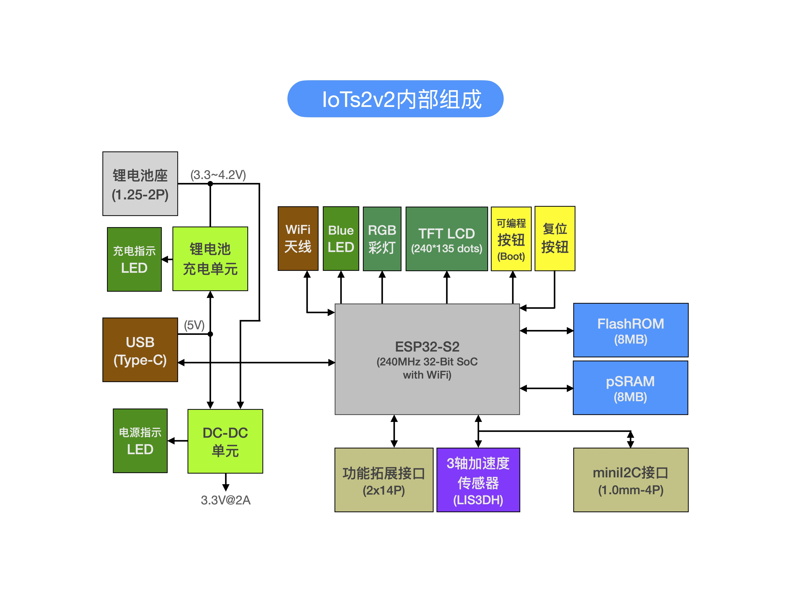

====================
IoTs2是什么？
====================

IoT(Internet of Things)是近10年持续的热词，从概念到落地、普及应用，刚过去的数年内的很多种成功的创新商业模式几乎都有IoT技术，
譬如共享xx、智能xx等。我们想要了解和学习IoT技术，是否有容易的、低成本的方法呢？IoTs2正是为此目的而设计，几十元的成本、
几十个小时的验证即可掌握IoT的核心技术细节。

IoTs2是一种小体积的、低功耗的、低成本的、高计算性能的IoT型嵌入式系统。IoTs2不仅支持UART(或RS485)、CANBus等有线的低速实时网络接口，
以及USB接口，还支持WiFi(2.4GHz)高速无线网络接口。除了板载的可编程按钮、指示灯、RGB彩灯、视网膜级彩色LCD、加速度传感器等资源，
IoTs2具有18个可编程I/O(呈DIP排列)。

为了方便我们了解IoTs2的资源，下图给出IoTs2内部单元的组成框图。

(IoTs2_v1)

(IoTs2_v2)

