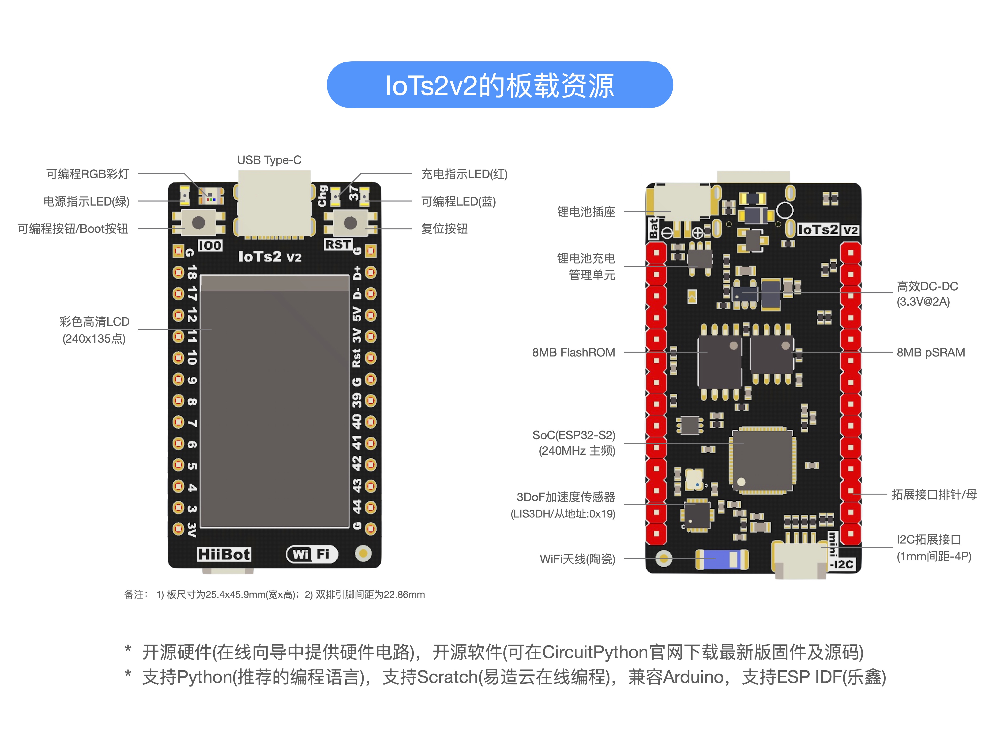

====================
IoTs2板载资源
====================

现在可以进一步认识IoTs2，了解IoTs2的板载资源。IoTs2具有丰富的板载资源，如下图所示。

(IoTs2_v1)

(IoTs2_v2)

**主控制器(SoC)**：240MHz 32-Bit Soc，片内带有2.4GHz WiFi(支持IEEE 802.11 b/g/n，最高数据速率可达150M)。

**存储器资源**：SoC片内320KB SRAM和128KB FlashROM，片外扩展(QSPI)8MB pSRAM(伪静态RAM)和8MB FlashROM。

**传感器与输入资源**：3轴加速度传感器(运动姿态、摇晃和敲击等运动感知)，1个可编程按钮输入，10个人体触摸输入。

**显示器和输出资源**：240*135点阵近视网膜级高清彩色LCD显示器，1个可编程RGB彩灯，1个可编程蓝色LED。

**板载供电单元**：电池插座，单节锂电池充电管理单元，高效的开关型DC-DC(IoTs2_v1: 3.3V@1.2A输出，约4W功率; IoTs2_v2: 3.3V@2A输出，约6.5W)，板载充电LED，电源LED。

**功能拓展接口**：带有1.0mm间距的4P miniI2C接口(或称qwIIC)，2.54间距的2*14P拓展接口。

**通讯接口**：USB Type-C接口(可编程为HID[鼠标/键盘类设备]、CDC[虚拟串口类设备]和MSC[大容量存储器/可移动磁盘类设备]等三类常用USB通讯类)，
WiFi(支持IEEE 802.11 b/g/n，板载高效能的陶瓷天线)，2xI2C、4xSPI、2xUART、1xCANBus/TWI、1xI2S等串行通讯接口。

**编程语言**：支持三种编程语言和4种环境。Scratch图形化语言，易造云(https://www.ezaoyun.com)在线编程；C/C++语言，Arduino IDE(安装和环境搭建详见 https://github.com/espressif/arduino-esp32)和ESP-IDF；Python语言，建议使用MU编辑器(安装详见 https://codewith.mu/)，板上带有数十个Python示例程序(Python API接口详见 https://circuitpython.readthedocs.io/en/latest/docs/index.html) 
