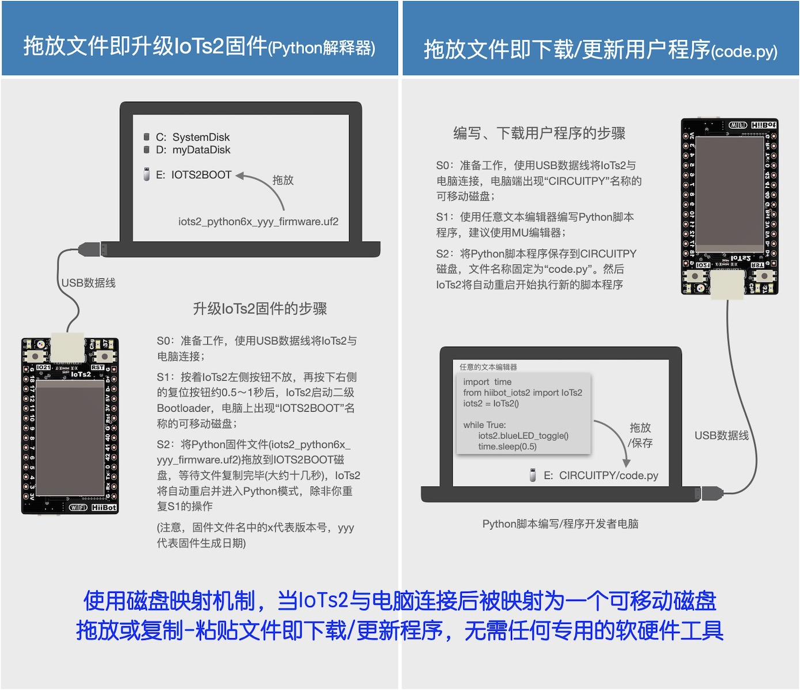
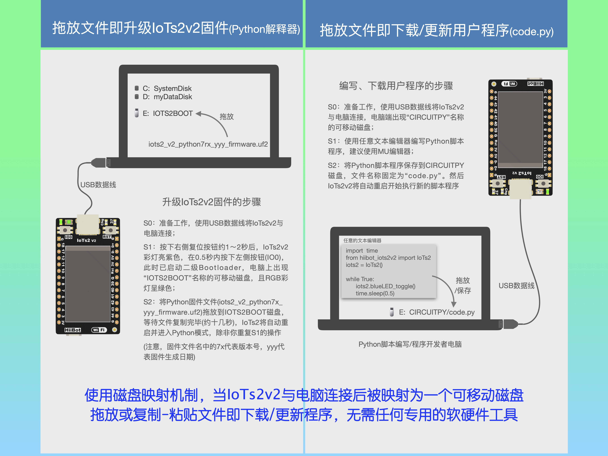
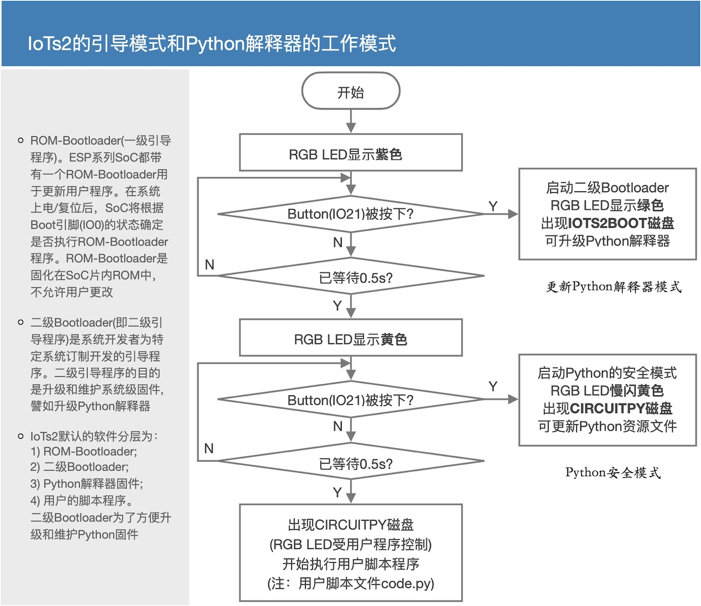
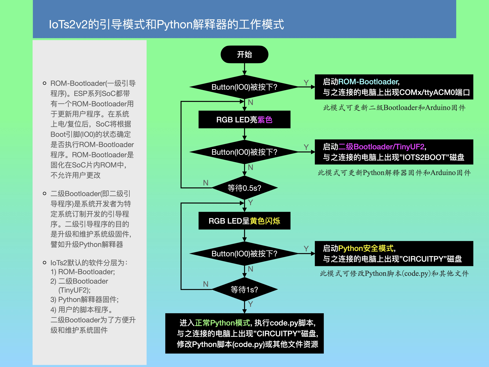

==========================
使用Python对IoTs2编程
==========================

Python是过去的几年内普及速度最快的一种编程语言，尤其在网络编程应用领域，Python几乎是独角兽。
目前，Python作为嵌入式系统的编程语言的相关技术发展速度很快，嵌入式C++编程的普及得益于活跃的Arduino开源社区，
嵌入式Python编程技术大有赶超C++的趋势，不仅少了编译的步骤，脚本(文本)文件🆚二进制文件的下载在工具成本和速度等方面也极具优势。
很显然，从网络编程、程序编译和下载等方面考虑，使用Python编程语言学习IoT技术是最优的选择。

对IoTs2编程应用时，首选的编程语言是Python。IoTs2默认的编程环境和编程语言是Python，当IoTs2出厂时已默认安装Python解释器，
使用USB数据线将IoTs2与电脑连接后只需要修改并保存CIRCUITPY磁盘上的code.py脚本(文本)文件即可改变IoTs2的功能。

啊哈！嵌入式系统编程已变得如此简单！必须归功于嵌入式Python编程语言相关的技术发展。当我们使用USB数据线将IoTs2与电脑正确连接后，
IoTs2是一个可移动磁盘(默认的磁盘名称为CIRCUITPY)，添加或删除Python库文件、维护图片和声音等资源文件、
修改用户的脚本程序文件(code.py)都如同我们在Windows、macOS、Linux系统文件资源管理器中的操作一样。
这是你记忆中的嵌入式系统开发环境吗？xxIDE等庞大的专用的嵌入式系统软件开发环境，JTAG、ICE等专用的硬件下载工具，
使用Python对IoTs2编程时这些统统不需要了，一个文本编辑器的应用程序(这是所有桌面OS自带的App)即可。

IoTs2的磁盘映射分为2种：BootLoader磁盘和Python解释器磁盘。进入两种磁盘的方法和两种磁盘的使用方法如下图所示：

（IoTs2_v1)

（IoTs2_v2)

注意：IoTs2v2升级Python固件的方法略有改变，主要原因是二级Bootloader已经改变。

BootLoader磁盘的名称为IOTS2BOOT，将IoTs2的固件文件拖放到该磁盘即可更新/升级Python解释器；
Python解释器磁盘的名称为CIRCUITPY，将我们编写的Python脚本程序保存到该磁盘根目录的code.py文件即为下载/更新应用程序。

IoTs2默认带有Python解释器固件，使用IoTs2板载的可编程按钮和复位按钮可以让IoTs2进入三种不同的模式：
BootLoader模式(可更新Python解释器固件)、Python的正常模式(立即执行code.py)、Python的安全模式(不执行code.py)。
进入这些模式的操作流程如下图所示。

（IoTs2_v1)

（IoTs2_v2)

注意：IoTs2v2的工作模式也稍有改变，ROM-Bootloader模式可更新二级Bootloader和Aruduino固件；启动二级Booloader的方法也稍有改变；
等待进入Python安全模式的黄色指示灯是闪烁状态(在v1板上不闪烁)。

为什么需要Python的安全模式呢？当我们编写的某些Python脚本程序并保存到Python磁盘(即CIRCUITPY磁盘)之后或许引起某些严重问题，
Python的安全模式将不执行“问题”程序让我们有机会修改他们。

IoTs2的Python脚本程序是什么样的呢？譬如下面的代码是Python脚本程序

.. code-block::  python
  :linenos:

  import time
  #from hiibot_iots2 import IoTs2  # IoTs2
  from hiibot_iots2v2 import IoTs2  # IoTs2v2
  iots2 = IoTs2()
  iots2.blueLED_bright = 1.0
  while True:
      iots2.blueLED_toggle()
      time.sleep(0.5)

当我们使用USB数据线(注意！USB数据线，不是USB充电线)将IoTs2与电脑连接好之后，大约1～2秒后IoTs2将进入Python的正常模式，
通过复制-粘贴的操作并用上面的代码覆盖/CIRCUITPY/code.py文件中的程序代码，然后保存该文件。然后，我们会观察到IoTs2上的蓝色LED呈闪烁状态。
修改和更新IoTs2的Python脚本程序就像这样的“修改-保存”文本文件一样地简单。为什么IoTs2的蓝色LED会闪烁呢？上面的程序中，
前两行分别导入time库、IoTs2库，第3行代码将IoTs2类实例化为名叫“iots2”的对象，第4行代码则设置蓝色LED的亮度属性为1.0(即最亮)，
在无穷循环程序中重复执行 1) 切换蓝色LED的状态；2) 睡眠0.5秒。

注意：IoTs2v2的库文件名称为“hiibot_iots2v2”，v1和v2两种板上硬件资源的分配略有不同。

