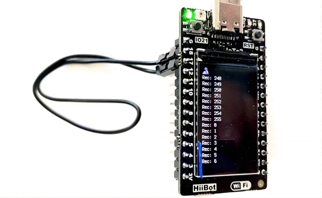
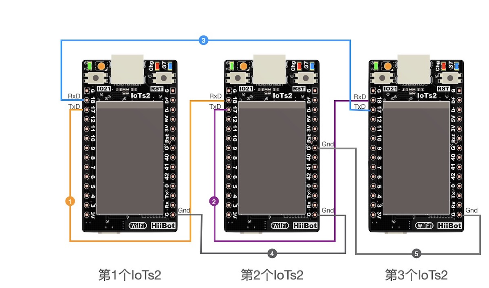
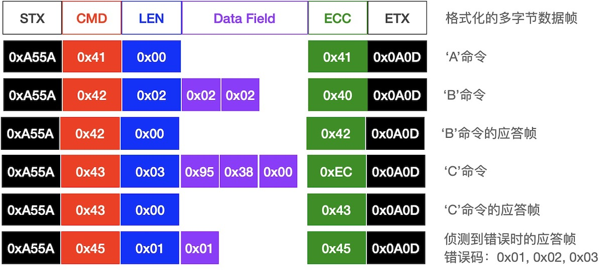

====================
UART通讯
====================

UART(通用异步收发器)是IoT系统的基本功能组件，使用2个信号线即可实现两个IoT系统之间的全双工通讯，这两个信号分别称作RxD(异步串行数据输入)、
TxD(异步串行数据输出)。异步通讯，意味着通讯双方不使用专用的同步时钟信号，譬如I2C和SPI等串行通讯接口都有专用的同步时钟信号。
全双工通讯指的是通讯双方可以同时发送和接收数据。

事实上，我们一直在使用UART，譬如使用USB数据线将IoTs2与电脑连接后，在MU编辑器中使用REPL，即输入一行完整的Python脚本程序并按下回车键(Enter)，
IoTs2的Python解释器立即执行该程序语句并产生执行结果。使用REPL期间，IoTs2的Python解释器与电脑上的MU编辑器之间使用UART通讯，
当然现在的桌面计算机几乎都没有标准的UART接口，电脑端使用的是“USB-Serial”桥虚拟串口。目前仍有很多小设备在使用UART，譬如GPS模块、
NBIoT等蜂窝网通讯模块、WiFi和BlueTooth通讯模块。

IoTs2具有2个标准的UART功能单元，意味着我们可以使用UART接口同时连接至少2个独立的UART接口型外部功能模块，譬如GPS、NBIoT等。
但是需要注意的是，IoTs2的其中一个UART也被一级BootLoader用作固件更新和下载端口使用，当IoTs2的复位后到二级BootLoader启动前这段时间内该UART也用作CPU启动信息输出使用。
因此，使用IoTs2的Rx和Tx两个引脚(在IoTs2板上有清晰地标示)当作UART的信号引脚时务必注意复位后Tx引脚将会输出一些字符串信息，
请确保这些信息不会影响外部接口的功能。

IoTs2的另外一个UART的2个信号可以使用任一I/O引脚！除了已固定用作UART的Rx和Tx两个引脚外，IoTs2总计有16个GPIO，
你可以使用其中的任意2个引脚当作UART的2个信号接口。

------------------------

单个IoTs2的“数字接龙”
------------------------

UART的应用场景大多数是2个系统之间的互联通讯，当我们手上仅有一个IoTs2时，除了使用“USB-Serial”桥虚拟串口与电脑通讯之外，
仍可以实现“自发自收”功能来测试UART通讯，掌握UART通讯接口的编程。

我们的第一个示例程序的执行效果如下图：

执行该示例程序之前，请使用一根两母头的杜邦线(或跳线帽)将IoTs2的IO17和IO18引脚短接，示例程序初始启动后会在LCD屏幕上提示“Press the button to start game”，
即按下IoTs2的按钮(IO21位置的按钮，不是RST按钮！)即可开始游戏。一旦按下IoTs2的按钮，我们将会在LCD屏幕上看到“数字接龙”游戏的效果。

本示例程序的代码如下：

.. code-block::  python
  :linenos:

  import time               # time moudle
  import board, busio       # board and busio modules
  from hiibot_iots2 import  IoTs2     # use the Button and BlueLED of IoTs2
  iots2 = IoTs2()
  iots2.blueLED_bright = 1.0          # turn on BlueLED
  uart = busio.UART(
          board.IO17, board.IO18,     # two Pins(TxD, RxD)
          baudrate=115200,            # baudrate: 9600 is default
          timeout=0.01,               # waiting time(s) for read(nBytes), and readinto(buf, nBytes)
          receiver_buffer_size=1)     # size of buffer
  uart.reset_input_buffer()           # clear input buffer
  outBuf = bytearray(1)               # out buffer, uart.write(buf, nBytes)
  print("Press the button to start game")
  while True:
      iots2.button_update()        # update the Button State
      if iots2.button_wasPressed : # start our game, send a digit
          outBuf[0] = 0            # any digit: 0~255
          uart.write(outBuf, 1)    # send the first digit
          print("Go it! the first was sent")
      if uart.in_waiting>0:        # check input buffer isn't empty
          inBuf = uart.read(1)     # return a bytearray type
          if inBuf is not None :   # inBuf isn't None
              iots2.blueLED_toggle()      # toggle BlueLED (turn off)
              time.sleep(0.1)
              print( 'Rec: {}'.format(inBuf[0]) )
              if int(inBuf[0]) < 255:
                  outBuf[0] = inBuf[0]+1  # increment and send this digit
              else:
                  outBuf[0] = 0           # rollback: .., 254, 255, next 0
              uart.write(outBuf, 1)
              iots2.blueLED_toggle()      # toggle BlueLED (turn on)
              time.sleep(0.1)

将上面的示例代码复制-粘贴并保存到IoTs2的/CIRCUITPY/code.py文件中，然后IoTs2将立即开始执行该程序。请将IO17和IO18两个I/O引脚短接，
我们将会看到上图的执行效果。

程序代码的详细注释如下：

  - 第1行，导入time模块
  - 第2行，导入board和busio两个IoTs2的Python解释器内建的模块。board模块定义IoTs2的所有GPIO引脚名，busio模块的UART子类是本示例的核心
  - 第3行，从/lib/hiibot_iots2.py模块中导入IoTs2类
  - 第4行，将IoTs2类实例化为iots2对象
  - 第5行，将iots2对象的blueLED_bright属性(即BlueLED的亮度)设置为1.0(即最亮)
  - 第6～10行，将busio.UART实例化为uart对象，并指定该对象的TxD和RxD引脚分别为board.IO17和board.IO18，波特率为115200，超时等待时间为0.01秒，接收缓冲区仅1个字节
  - 第11行，清空uart对象的接收缓冲区，丢弃以前的接收数据
  - 第12行，定义一个名叫outBuf的字节数组(即bytearray型)当作发送缓冲区，本示例每次仅发送一个字节，因此该数组的长度为1
  - 第13行，向Python解释器的串口控制台(如MU编辑器的串口控制台)和LCD屏幕输出提示信息
  - 第14行，定义一个无穷循环
  - 第15行，(无穷循环的第1行) 更新iots2对象的按钮状态
  - 第16行，(无穷循环的第2行) 检查iots2对象的按钮是否已被点击，如果被点击则执行以下三行语句
  - 第17～19行，(无穷循环的第3～5行) 当前一句if条件满足时，首先设置outBuf[0]为0，然后调用uart对象的write接口将outBuf中的这个数据发送出去，最后向控制台/LCD输出提示信息
  - 第20行，(无穷循环的第6行) 判断uart对象的in_waiting属性值是否大于0，如果大于0则执行下面的12行语句，否则继续下一个无穷循环
  - 第21～22行，(无穷循环的第7～8行) 如果uart.in_waiting属性值大于0，则调用uart对象的read接口将接收缓冲区的数据读到inBuf数组，如果inBuf数组是非空的则执行下面的10行语句，否则继续下一个无穷循环
  - 第23行，(无穷循环的第9行) 切换iots2对象的BlueLED状态
  - 第24行，(无穷循环的第10行) 延迟0.1秒
  - 第25行，(无穷循环的第11行) 向控制台或LCD屏幕输出提示信息，其中包含接收到的数据的十进制表示
  - 第26～29行，(无穷循环的第12～15行) 将outBuf[0]设置为inBuf[0]+1，如果加1后的值大于255则设置outBuf[0]=0(即从255回滚到0)。注意：这4个语句是“数字接龙”游戏的关键
  - 第30行，(无穷循环的第16行) 使用uart对象的write接口将outBuf[0]发送出去
  - 第31行，(无穷循环的第17行) 切换iots2对象的BlueLED状态
  - 第32行，(无穷循环的第18行) 延迟0.1秒

请注意本示例程序的第6～10行定义uart对象的方法，如果我们打算使用IoTs2的其他I/O引脚当作uart对象的TxD和RxD，则修改第7行中的I/O引脚编号即可。
此外，baudrate参数是保障通讯双方正确通讯的基本参数，如果两个系统的此参数不一致将会导致无法正常通讯，务必将通讯双方的该参数配置为相同的值。

UART子类的更多属性和接口方法请参见本文底部。

------------------------

多个IoTs2的“数字接龙”
------------------------

仅使用一个IoTs2实现的数字接龙非常好理解，TxD和RxD两个信号短接，TxD引脚发送出去的数据被RxD接收到，然后加1并再发送出去，
期间惟一要注意的是“如果加1后大于255”则回滚到0，前面动图中看到的效果就不难理解。为啥我们发送的数据不能大于255呢？你能说出其中的缘由吗？

如果我们有多个IoTs2玩“数字接龙”游戏或许更好玩，甚至还会出现某些意外，找出这些意外的根源所在，能够帮助我们更好地理解UART及其编程应用。
首先将3个IoTs2使用UART通讯接口连接在一起，当然更多个IoTs2的连接思路是相同的，你可以称这种连接为“菊花链”形式：

  - 第1个IoTs2的TxD与第2个IoTs2的RxD连接
  - 第2个IoTs2的TxD与第3个IoTs2的RxD连接
  - ..
  - 第n-1个IoTs2的TxD与第n个IoTs2的RxD连接
  - 第n个IoTs2的TxD与第1个IoTs2的RxD连接

连接他们需要的材料仅仅是杜邦线。然后将上面的示例程序保存到所有的IoTs2的code.py文件中，无需任何修改，给所有IoTs2通上电，
随意按下某个IoTs2的按钮，我们观察所有IoTs2的LCD屏幕，你会发现连续的数字在多个IoTs2之间传递，“数字接龙”游戏难道不是这样吗？

3个IoTs2的连接方法如下示意图，需要使用5根双母头的杜邦线，按下图连接即可。

除了TxD和RxD两个异步串行通讯的信号之外，多个IoTs2之间使用UART通讯时，务必将这些IoTs2的Gnd引脚连接在一起。上图中的第(4)和第(5)根线将3个IoTs2俩俩连接，
由于IoTs2的双排插针上的所有Gnd引脚是内部连通的，上图的连接方法实质上是将3个IoTs2的Gnd连接在一起。

------------------------

数据帧的收发操作
------------------------

前面的示例中每次仅发送/接收单个字节，在实际的异步串行通讯应用中往往需要发送/接收多个字节组成的特定格式的数据帧，譬如下图所示的数据帧：

虽然上图所示的数据帧仅仅是一个示例，但实际应用中的数据帧绝大多数都是这种形式。通讯双方定义特定格式的数据帧及其每一个数据域中每个字节的含义，
这就是通讯协议的重要组成部分，目的是遵循此协议的收发双方能够明确每个数据帧代表的具体信息。

下面的示例程序采用上图的通讯协议来接收数据帧，并针对不同数据帧发送不同的应答，当接收者发现错误时则发送错误所对应的应答。

程序代码如下：

.. code-block::  python
  :linenos:

  import time               # time moudle
  import random
  import board, busio       # board and busio modules
  from hiibot_iots2 import  IoTs2     # use the Button and BlueLED of IoTs2
  iots2 = IoTs2()
  iots2.blueLED_bright = 1.0          # turn on BlueLED
  uart = busio.UART(
          board.IO3, board.IO4,       # two Pins(Tx, RxD)
          baudrate=115200,            # baudrate: 9600 is default
          timeout=0.01,               # waiting time(s) for read(nBytes), and readinto(buf, nBytes)
          receiver_buffer_size=10)    # size of buffer
  uart.reset_input_buffer()           # clear input buffer
  outBuf = bytearray(1)               # out buffer, uart.write(buf, nBytes)
  sFrame = (  bytearray(b'\x41\x00'), 
              bytearray(b'\x42\x02\x02\x45'), 
              bytearray(b'\x43\x03\x12\x34\x56') )
  nFrame = (2, 4, 5)
  print("Press the button to send a Cmd")
  # send the formated data frame: STX, CMD, Len, Data Field, ECC, ETX
  # given CMD, LEN, Data Field, then calculate ECC and append it on the frame
  def send(bytes, nBytes):
      global uart
      if nBytes<2:
          return
      if nBytes>5:
          nBytes = 5
      sbuf = bytearray(b'\xA5\x5A')
      ecc = 0x0
      for i in range(nBytes):
          sbuf.append( bytes[i] )  # append a byte on the sbuf
          ecc ^= bytes[i]
      sbuf.append(ecc)
      sbuf.append(0x0A)
      sbuf.append(0x0D)
      uart.write(sbuf, nBytes+5)
  # send a response
  def sendAck(cmd):
      sb = bytearray(b'\x00\x00')
      sb[0] = cmd
      send(sb, 2)
  # send a error response
  def sendErrorAck(errorCode):
      sb = bytearray(b'\x45\x01\x00')
      sb[2] += errorCode
      send(sb, 3)
      print('Recv failed{}'.format(errorCode))
  # check the readable bytes of received buffer, then read and resolve it
  def recv():
      global uart
      rbuf = bytearray(5)
      if uart.in_waiting<1:
          return None
      else:
          tryTimes = 0
          while True:
              time.sleep(0.1)
              if uart.in_waiting>=7:
                  break
              tryTimes += 1
              if tryTimes>3:
                  uart.reset_input_buffer()
                  return None
          time.sleep(0.02)
          rBytes = uart.in_waiting   # check the valid bytes
          rb = uart.read(rBytes)     # read the data frame
          if rb[0]!=0xA5 or rb[1]!=0x5A or rb[-2]!=0x0A or rb[-1]!=0x0D:
              sendErrorAck(0x01)
              return None
          ecc = 0x00
          for i in range(rBytes-5):
              rbuf[i] = rb[2+i]
              ecc ^= rbuf[i]
          if rb[-3]!=ecc:
              sendErrorAck(0x02)
              return None
          if rbuf[0]!=0x41 and rbuf[0]!=0x42 and rbuf[0]!=0x43 and rbuf[0]!=0x45:
              sendErrorAck(0x03)
              return None
          return rbuf
  # resolve received data frame, and execute some action
  def resolving(rbuf):
      nBytes = len(rbuf)
      if nBytes>=2:
          if rbuf[0]==0x41:
              sendAck(0x41)
              print('Recv Cmd 0x{:02X}, send Ack'.format(rbuf[0]))
          elif rbuf[0]==0x42:
              if rbuf[1]==0x02:
                  sendAck(0x42)
                  print('Recv Cmd 0x{:02X}, send Ack'.format(rbuf[0]))
              else:
                  print('this 0x{:02X} response'.format(rbuf[0]))
          else: # rbuf[0]==0x43
              if rbuf[1]==0x03:
                  sendAck(0x43)
                  print('Recv Cmd 0x{:02X}, send Ack'.format(rbuf[0]))
              else:
                  print('this 0x{:02X} response'.format(rbuf[0]))
      else:
          pass
  while True:
      iots2.button_update()        # update the Button State
      if iots2.button_wasPressed : # start our game, send a digit
          uart.reset_input_buffer()
          rd = random.randint(0,2) # only {0, 1, 2}
          send(sFrame[rd], nFrame[rd])
          print('send Cmd 0x{:02X} ok'.format(sFrame[rd][0]))
      recbuf = recv()
      if recbuf is not None:
          resolving(recbuf)
      time.sleep(0.01)

虽然这个示例程序代码看起来很多，111行！但从程序架构角度看，非常好理解。整个示例代码分为3个部分：初始化部分，函数声明(共5个函数)部分，
无穷循环部分。其中初始化部分仅14行代码，无穷循环仅10行代码，其他的代码用于声明5个UART通讯接口的功能函数。5个UART通讯接口的功能函数包括，
发送一个完整数据帧(参见上图)，发送一个应答数据帧，发送一个接收错误的对应应答数据帧，接收一个完整数据帧(期间并检查是否存在接收错误，
如果发现接收错误则立即给出错误应答帧)，解析接收到的数据帧并给出应答。

将示例代码保存到IoTs2的/CIRCUITPY/code.py文件后，将IO3和IO4短接，IoTs2执行示例代码时，按下IoTs2的按钮，我们将会看到以下信息：

.. code-block::  python
  :linenos:

  code.py output:
  Press the button to send a Cmd
  send Cmd 0x43 ok
  Recv Cmd 0x43, send Ack
  this 0x43 response
  send Cmd 0x41 ok
  Recv Cmd 0x41, send Ack
  Recv Cmd 0x41, send Ack
  Recv Cmd 0x41, send Ack
  Recv Cmd 0x41, send Ack
  Recv Cmd 0x41, send Ack
  Recv Cmd 0x41, send Ack
  ..
  send Cmd 0x42 ok
  Recv Cmd 0x42, send Ack
  this 0x42 response

按下IoTs2的按钮时，如果提示“send Cmd 0x42 ok”，或“send Cmd 0x43 ok”，然后将会再看到2行提示后程序将等待你再次按下按钮，
但是如果提示“send Cmd 0x41 ok”之后，我们将会看到一连串的“Recv Cmd 0x41, send Ack”提示，除非你再次按下IoTs2的按钮，
否则此过程将无穷无尽地持续下去。根据“resolving”函数的陈旭逻辑不难发现上述现象的缘由。

如果我们使用2个IoTs2，请找来3根杜邦线将两个IoTs2连接起来：

  - 第1个IoTs2的IO3与第2个IoTs2的IO4连接
  - 第2个IoTs2的IO3与第1个IoTs2的IO4连接
  - 两个IoTs2的Gnd连接在一起

并将此示例程序分别保存在两个IoTs2的code.py文件，无需任何修改，2个IoTs2都通上电之后，按下任何一个IoTs2的按钮，
此IoTs2的LCD屏幕将提示“send Cmd 0x42 ok”或“send Cmd 0x43 ok”，另一个IoTs2的CD屏幕上将提示“Recv Cmd 0x42, send Ack”或“Recv Cmd 0x43, send Ack”，
然后前一个IoTs2的屏幕将提示“this 0x42 response”或“this 0x43 response”，接着程序进入等待，等待你再次按下按钮。

或者某次按下某个IoTs2的按钮时提示“send Cmd 0x41 ok”，接着两个IoTs2都将连续地提示“Recv Cmd 0x41, send Ack”，
并无穷无尽地持续下去，除非我们再次按下某个IoTs2的按钮。

UART是一种面向字节编码的串行通讯接口，即单次传送数据的最小单位是一个字节(虽然该字节的实际二进制位数是可编程的，但习惯上仍称之为一个字节)，
所以我们在示例程序中使用字节数组(bytearray型)来交换发送和接收的数据。Python的bytearray中每个数据单元是单个字节，取值范围为0~255，
字节数组支持“append()”接口将一个字节(int型)数据添加到数组尾部，因此我们称之为字节数组，但该数据容器的数据个数支持动态地改变。
此外，在Python语言中，字符串、字节数组、列表、元组等数据集都支持反向下标的索引，譬如示例程序中的第66行和第73行语句中，
我们使用rb[-1]、rb[-2]、rb[-3]分别来访问字节数组的最后3个数据单元。

---------------------------------

.. admonition:: 
  总结：

    - UART及其接口
    - busio.UART类

.. Important::
  **busio类的UART子类的属性和接口**

    - busio.UART(tx, rx, baudrate=9600, bits=8, parity=None, stop=1, timeout=1.0, receiver_buffer_size=64, flow=None) 参数如下：

      - tx, rx: 必须使用 “board.IOx” 来指定这两个引脚
      - baudrate: 波特率参数，默认值为9600
      - bits: 数据位个数，默认值为8
      - parity: 奇偶校验参数，默认值为None(即不启用校验位)；另外两个有效值：busio.UART.Parity.EVEN和busio.UART.Parity.ODD
      - stop: 停止位个数，默认值为1；有效值: 1, 1.5, 2
      - timeout: 阻塞式接收过程的最大等待时间参数，单位是秒
      - receiver_buffer_size: 接收缓冲区的字节个数
      - flow: 是否启用硬件流控，默认值为None(即不启用硬件流控)
    
    - in_waiting (属性, 只读, 有效值：0~receiver_buffer_size), 用于检查接收缓冲区内可读的字节数
    - timeout (属性, 可读可写的), 指定read()/readinto()/readline()等接口的最大等待时间，单位是秒
    - reset_input_buffer()  (函数，无输入、输出参数和返回值) 清空接收缓冲区
    - write(buf, nBytes) (函数, 输入参数: 待发送的字节数据(必须是bytearray型)、待发送的字节个数, 返回值：发送成功的字节个数), 将buf中的前nBytes个字节数据从TxD引脚发送出去
    - read(nBytes) (函数, 输入参数：待读取的字节个数, 返回值：bytearray型inBuf), 等待并读取从RxD引脚接收到的数据，当收到nBytes指定的字节个数则立即返回，否则一直等待到超时后返回(返回值为None，或实际读取到的数据)
    - readinto(inBuf, nBytes) (函数, 输入参数：保存接收数据的字节数组，待读取的字节个数, 返回值：实际读取到的字节个数)，等待并读取从RxD引脚接收到的数据，数据保存在inBuf中，返回值为实际读取到的数据字节个数，返回值为0则inBuf为空
    - readline() (函数, 无输入参数, 返回值：bytearray型inBuf), 等待并读取RxD引脚接收到的数据，直到出现“换行键”字符出现则立即返回，返回值为已读取到的数据；或者超时返回，返回值保存有实际读取到的数据
